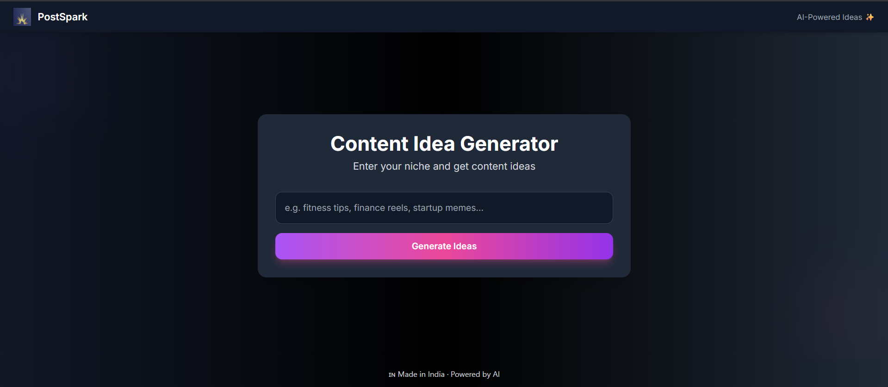

# 🚀 Post Generator

Instantly generate scroll-stopping social media post ideas based on your business and category.

### ✨ Features
- Smart idea templates
- Step-by-step instructions for each idea
- One-click "Copy All"
- Sleek animated UI with framer-motion
- Light lilac aesthetic 🟣

### ⚙️ Tech Stack
- React
- Framer Motion
- React Toastify

### 🛠️ Usage
1. Enter your Business name and Category
2. Click **Generate**
3. Select any idea to reveal step-by-step usage
4. Copy all ideas at once with a single click

### 🌐 Live Demo
[Link](https://post-generator-black-alpha.vercel.app/)

---

### 📸 Preview

---

### 🧠 Built By
[@SURYANSHI-WEB](https://github.com/SURYANSHI-WEB)
